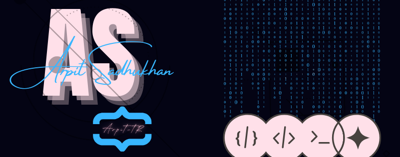

<a href="https://github.com/Arpit-tR">
 <p align="center">  </p>
</a>

<div align="right">
<!-- 

</div> -->

<div align="center">

```swift
Hello There, I'm Arpit.

My Top 3 Things

| Anime | Coding | Gaming |
```

<!-- <div align="center">
    <span style="color: #040414; font-size: 24px; font-weight: bold;">Hello There, I am Arpit.</span><br/>
    <span style="color: #040414; font-size: 20px; font-weight: bold;">My top 3 things</span><br/>
    <span style="color: #040414; font-size: 18px; font-weight: bold;">Anime | Coding | Games</span>
</div> -->

## Tech I Know


## Contributions

<p align="center">
  

  
</p>

## Currently Learning


<br/>

## Socials

<p align="center">
	<a href="https://www.linkedin.com/in/arpit-sadhukhan/">
		
	<a href="https://www.hackerrank.com/profile/arpit_sadhukhan">
		
	</a>
	<a href="https://www.reddit.com/user/The_Rider23/">
		
	</a>
	<a href="https://www.github.com/Arpit-tR/">
		
	</a>
	<a href="https://x.com/Arpit_Sadhukhan">
		
	</a>
</p>

<p align="center">  </p>
